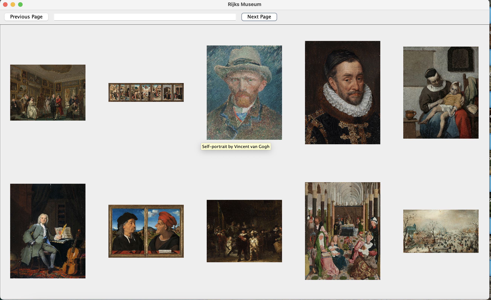
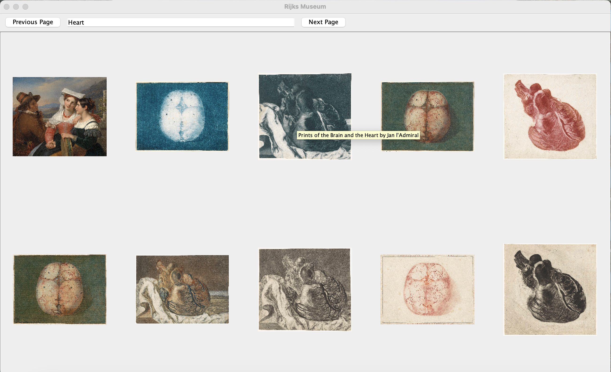
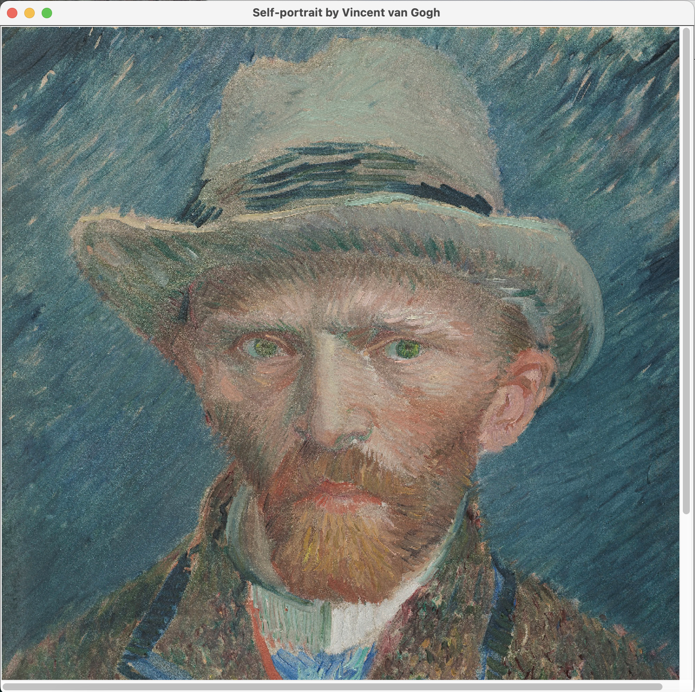

# Rijks Museum Project

The Rijks Museum Project is a project which uses the Rijks museum API to display artwork from the museum. 
Every page displays 10 pieces of art from the museum, and a tooltip shows the title and artist.

The search feature enables users to search for specific artists or titles.

Clicking on a piece of art will open a larger image of it on the screen.

### Technology
[Rijks API](https://data.rijksmuseum.nl/object-metadata/api/)

[API Key Implementation](https://github.com/andrewoid/apikeys)